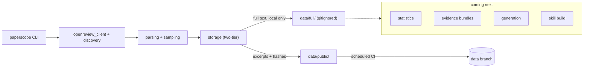

# PaperScope

[](https://github.com/lakshayxi/paperscope/actions/workflows/ci.yml)
[](https://github.com/lakshayxi/paperscope/actions/workflows/fetch-reviews.yml)

A venue-calibrated ML paper reviewer built from real peer reviews on OpenReview (2023–2026).

PaperScope fetches real reviews from top ML/NLP/Vision venues, builds calibration
reference files per venue, and packages them as a Claude Code skill — so when you ask
Claude to review a paper, it reviews like an actual ICLR or NeurIPS reviewer, not a
generic AI assistant.

---

## What it does

1. **Fetches** real peer reviews from OpenReview — one paper-centric record per forum,
   with reviews, rebuttals, and decisions nested together, not scattered across rows
2. **Accumulates** that data on a schedule, resumably and deduplicated, via a small
   GitHub Actions workflow
3. **Builds** venue calibration reference files — real score distributions, real
   accept/reject language, real hidden criteria
4. **Packages** everything as a Claude Code skill (`skill/`) that can be installed and
   used directly

---

## Architecture



The `statistics` / `evidence` / `generation` / `skill build` modules aren't built yet —
shown here so the diagram doesn't overclaim what exists today. See
[`docs/redistribution.md`](docs/redistribution.md) for why review text is split into a
full local tier and a excerpted public tier.

---

## Supported Venues

`VENUES`/`VENUE_GROUPS` in [`src/paperscope/config.py`](src/paperscope/config.py) list
~35 venue-years across 7 families. The scheduled automation currently targets **ICLR**
by default (see [Automation](#automation-github-actions) below) — other families fetch
fine via the CLI directly, they're just not on the default schedule yet.

| Group | Venues |
|---|---|
| ICLR | 2023, 2024, 2025, 2026 |
| NeurIPS | 2023, 2024, 2025 |
| ICML / TMLR | 2023, 2024, 2025 + TMLR rolling |
| CVPR / ICCV / ECCV | CVPR 2023–2025, ICCV 2023, ECCV 2024 |
| ACL / EMNLP / NAACL | 2023–2025 |
| AAAI / IJCAI | 2023–2026 |
| KDD | 2023, 2024 |

The pre-built Claude skill (`skill/references/`) currently ships calibration files for
ICLR, NeurIPS, ICML, and CVPR.

---

## Setup

```bash
git clone https://github.com/lakshayxi/paperscope
cd paperscope
pip install -e .
```

Set credentials (free account at [openreview.net](https://openreview.net)) — a token or
username/password both work; unauthenticated "guest" access is also supported by the
client but is unreliable in practice (OpenReview may challenge anonymous requests):

```bash
export OPENREVIEW_USERNAME='your_openreview_email'
export OPENREVIEW_PASSWORD='your_openreview_password'
# or: export OPENREVIEW_TOKEN='...'
```

---

## Usage

```bash
# Fetch unseen forums for a venue family/year
paperscope fetch venue --family iclr --years 2026 --papers 20 --seed 42

# Also refresh already-fetched forums that are unresolved or in an active review cycle
paperscope fetch venue --family iclr --years 2026 --refresh-policy active

# Fetch a single paper by URL
paperscope fetch forum --url "https://openreview.net/forum?id=XXXXX"

# Import an old corpus_<family>.json into the new schema
paperscope migrate corpus_iclr.json
```

Fetched data is stored two ways (see [Architecture](#architecture)):
`data/full/<family>.jsonl` (complete review text, never committed anywhere) and
`data/public/<family>.jsonl` + `<family>.manifest.json` (an excerpted, redistribution-
conscious index — this is what the CI workflow commits to the `data` branch).

Re-runs are deduplicated and resumable: a per-venue cursor tracks how far acquisition
has progressed, so repeated runs make progress instead of re-fetching the same forums.

### Legacy `expl.py`

`python expl.py bulk ...` / `python expl.py forum ...` still work — `expl.py` is now a
thin shim that explicitly translates them into the calls above. `analyze`/`skill`/`all`
aren't ported to the new CLI yet.

---

## Automation (GitHub Actions)

[`.github/workflows/fetch-reviews.yml`](.github/workflows/fetch-reviews.yml) runs
`paperscope fetch venue --refresh-policy active` on a schedule, so the corpus keeps
growing without a human running it manually.

- **Schedule**: weekly (Monday 06:00 UTC) — OpenReview data trickles in slowly, so daily
  polling would just burn CI minutes for near-zero new data most days.
- **Manual trigger**: Actions tab → *fetch-reviews* → *Run workflow*, with optional
  `family`/`years`/`papers`/`seed`/`refresh_policy` inputs.
- **Required secrets** (repo Settings → Secrets and variables → Actions):
  `OPENREVIEW_USERNAME` + `OPENREVIEW_PASSWORD`, or `OPENREVIEW_TOKEN`. No Anthropic key
  is needed for this workflow.
- **What's persisted, and where**: the workflow commits only to a dedicated `data`
  branch, never to `main` — the excerpted public index (`data/public/`), a resumability
  cursor (`data/full/*.cursors.json`, which carries no review content), and a compact
  `run_summary.json`. The full run log is uploaded as a workflow artifact (30-day
  retention), not committed anywhere.
- **Limitations**: fetch-only — `generate`/`build-skill` aren't part of this workflow and
  remain a manual/local step. Batches are intentionally small. Never merge or rebase the
  `data` branch into `main`; it's machine-generated state, not a feature branch.

---

## Installing the Skill

The `skill/` directory contains pre-built calibration files ready to use with Claude Code.

To install, copy the skill folder into Claude Code's skills directory:

```bash
cp -r skill/ ~/Library/Application\ Support/Claude/skills/paperscope
```

> The exact skills path may vary by OS and Claude Code version. Check your Claude Code settings for the correct location, or place the folder wherever Claude Code looks for custom skills.

Then in any Claude Code session:
- *"Review this paper for ICLR 2025"*
- *"What score would this get at NeurIPS?"*
- *"Write a reviewer report targeting CVPR"*
- *"Is this paper ready to submit to ICLR 2026?"*

The skill automatically detects the venue and loads the corresponding reference file — scores, language patterns, hidden criteria, and rebuttal effectiveness are all calibrated to real data.

See [`demo/`](demo/) for a sample fetched batch, corpus snapshot stats, and one example
review generated by the current skill.

---

## Updating the Skill (the learning loop)

The pre-built skill files in `skill/references/` are calibrated on real data, currently
via a manual process (a structured, evidence-traced generation pipeline is planned but
not built yet). To improve them with fresh data:

1. Fetch a new batch: `paperscope fetch venue --family iclr --years 2026 --papers 20`
2. Read the new records in `data/full/iclr.jsonl` (or ask Claude to)
3. Update `skill/references/iclr.md` with new patterns tagged `*(real ICLR 2026)*`
4. Repeat

Reference files **accumulate** knowledge — patterns are never deleted, only added and tagged by year. This means you can ask Claude to review a paper specifically against 2026 trends vs. 2024 patterns.

---

## How calibration works

Each `references/<venue>.md` file contains:

- **Score calibration** — exact score labels (e.g. ICLR's "6 = marginally above acceptance threshold") and what they mean in practice
- **Accept signals** — patterns that correlate with high scores, backed by real reviewer quotes
- **Reject signals** — patterns that reliably cause rejection, with exact quotes showing how reviewers phrase them
- **Hidden criteria** — unwritten rules inferred from review data (e.g. ICLR penalizes complexity relative to gain more than any other venue)
- **Reviewer language** — exact phrases accept vs. reject tier reviewers use
- **Year-over-year drift** — how standards shifted across years (e.g. 2025→2026: high reviewer score variance now hurts more than before)
- **Rebuttal effectiveness** — what actually moves scores vs. what gets ignored

---

## Project Structure

```
paperscope/
├── expl.py                        # legacy-command compatibility shim
├── pyproject.toml
├── src/paperscope/
│   ├── config.py                  # venue registry, schema/refresh defaults
│   ├── models.py                  # ForumRecord paper-centric schema
│   ├── openreview_client.py       # auth (token / password / guest)
│   ├── discovery.py                # review-invitation discovery
│   ├── parsing.py                  # note parsing, ForumRecord construction
│   ├── sampling.py                 # seeded/deterministic acquisition
│   ├── refresh_policy.py           # existing-forum refresh selection
│   ├── storage.py                  # two-tier JSONL + manifest, migration
│   └── cli.py                      # `paperscope` entry point
├── tests/
├── .github/workflows/
│   ├── ci.yml                      # lint + test
│   └── fetch-reviews.yml           # scheduled fetch automation
├── docs/
│   └── redistribution.md
├── demo/
├── skill/
│   ├── SKILL.md                    # Claude Code skill definition
│   └── references/
│       ├── iclr.md
│       ├── neurips.md
│       ├── icml.md
│       └── cvpr.md
└── README.md
```

---

## Adding a New Venue

1. Add a tuple to `VENUES` in `src/paperscope/config.py`: `("CONF YEAR", "venue.org/CONF/YEAR/Conference", "v2", "family")`
2. Add the display name to the right list in `VENUE_GROUPS`
3. Run `paperscope fetch venue --family <family>` — the resumability cursor means only new forums get fetched

---

## Requirements

- Python 3.11+
- `openreview-py`
- OpenReview account (free at [openreview.net](https://openreview.net))

No Anthropic API key is needed for fetching, storage, or the CI automation — `anthropic`
is an optional dependency (`pip install -e ".[llm]"`) only needed for a planned
LLM-assisted generation command, not built yet.
