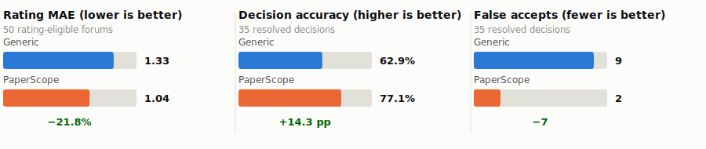
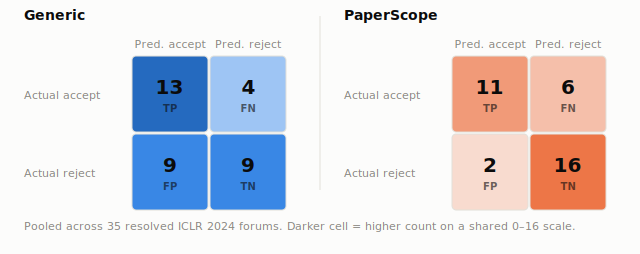
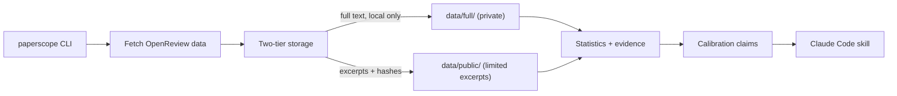

# PaperScope

[](https://github.com/lakshayxi/paperscope/actions/workflows/ci.yml)
[](https://github.com/lakshayxi/paperscope/actions/workflows/fetch-reviews.yml)

PaperScope learns how a research venue evaluates papers by analyzing its past
OpenReview reviews and decisions. It turns those patterns into a Claude Code skill that
provides venue-specific feedback instead of a generic paper review.

The data pipeline supports seven ML, NLP, and vision venue families. The skill shipped
in this repository currently includes venue-specific calibration for ICLR only; other
venues can still be reviewed, but without venue-specific calibration.

---

## Does calibration help?

Two independent pilots compared Claude Code reviews of ICLR 2024 papers with and without
PaperScope's calibration reference. Within each pilot, both conditions used the same
model settings and reviewed the same papers. The two pilot datasets were disjoint, and
the true outcomes remained hidden until scoring.



Across 50 papers with reviewer ratings and 35 papers with final accept/reject outcomes:

- **21.8% lower rating error** — MAE 1.33 → 1.04
- **Decision accuracy: 62.9% → 77.1%**
- **False accepts: 9 → 2** — the largest observed improvement in the pooled decision
  results

**The trade-off.** The calibrated condition was more selective: it substantially
reduced false accepts, while producing two additional false rejects.



These are descriptive, abstract-only ICLR 2024 pilot results — not evidence of
statistical significance or cross-venue generalization. Full methodology and metrics:
[`docs/evaluation.md`](docs/evaluation.md).

---

## How PaperScope works

1. **Fetch** OpenReview discussions and decisions for a venue, one paper per record.
2. **Measure** venue-specific reviewer patterns — score distributions, accept/reject
   language, recurring review patterns and explicitly labeled inferred criteria.
3. **Build** evidence-backed calibration references, with every claim linked to the
   supporting statistics and review evidence behind it.
4. **Use** the generated Claude Code skill to review a new paper with venue-specific
   evidence and guidance.

---

## Quick start

Requires Python 3.11+. A free [OpenReview](https://openreview.net) account is
recommended for reliable fetching.

```bash
git clone https://github.com/lakshayxi/paperscope
cd paperscope
pip install -e .

export OPENREVIEW_USERNAME='your_openreview_email'
export OPENREVIEW_PASSWORD='your_openreview_password'

# Fetch a small ICLR sample
paperscope fetch venue --family iclr --years 2026 --papers 20
```

Then either install the preliminary reference included in this repository, or run the
calibration-building workflow on your own corpus:

```bash
# Option A: install the shipped skill as-is
cp -r skill/ ~/Library/Application\ Support/Claude/skills/paperscope

# Option B: build a fresh calibration reference and validate it
paperscope stats    --corpus data/full/iclr.jsonl --output artifacts/statistics
paperscope evidence --corpus data/full/iclr.jsonl --output artifacts/evidence.json --seed 42
# -> author artifacts/claims.json (see docs/generation.md), then:
paperscope build-skill --claims artifacts/claims.json \
                        --statistics artifacts/statistics/statistics.json \
                        --evidence artifacts/evidence.json --output skill
paperscope validate-skill --path skill

# Install the newly built skill, replacing Option A's copy
rm -rf ~/Library/Application\ Support/Claude/skills/paperscope
cp -r skill/ ~/Library/Application\ Support/Claude/skills/paperscope
```

> The Claude Code skills directory may vary by operating system or installation.

Then, in any Claude Code session: *"Review this paper for ICLR"* or *"What score would
this get at ICLR 2026?"*

Full command reference: [`docs/statistics_and_evidence.md`](docs/statistics_and_evidence.md),
[`docs/generation.md`](docs/generation.md), [`docs/skill_building.md`](docs/skill_building.md).

---

## Architecture



Review data is stored in two tiers: complete review text remains local and gitignored,
while the public tier contains limited excerpts and content hashes designed for more
responsible redistribution. Only the public tier is committed by the automation. See
[`docs/redistribution.md`](docs/redistribution.md) for why.

An optional GitHub Actions workflow
([`fetch-reviews.yml`](.github/workflows/fetch-reviews.yml)) periodically fetches new
OpenReview records so the corpus keeps growing without a human running it manually.

---

## Supported scope

- **Fetching** supports seven venue families (ICLR, NeurIPS, ICML/TMLR, CVPR/ICCV/ECCV,
  ACL/EMNLP/NAACL, AAAI/IJCAI, KDD) — see [`src/paperscope/config.py`](src/paperscope/config.py)
  for the full venue-year list.
- **The generated skill** currently has a validated calibration reference for ICLR only.
  Other venues can still be reviewed, but without venue-specific calibration.
- **The evaluation above used a different reference than the one shipped today.** The
  pilots were scored against a frozen ICLR 2024 calibration reference built from 40
  papers specifically for that test. The skill shipped in this repo
  ([`skill/references/iclr.md`](skill/references/iclr.md)) is a separate, preliminary
  ICLR 2026 reference built from only 10 papers whose review cycle hasn't resolved yet —
  it did not produce the results above.

---

## Limitations

- The shipped ICLR reference is preliminary and based on 10 papers from an unresolved
  review cycle.
- The evaluation is abstract-only and single-venue, and does not establish statistical
  significance or cross-venue performance.
- Calibration-claim generation still includes a manual model or human review step.

---

## Documentation

- [`docs/evaluation.md`](docs/evaluation.md) — full evaluation methodology and metrics
- [`docs/statistics_and_evidence.md`](docs/statistics_and_evidence.md) — statistics and
  evidence-bundle commands
- [`docs/generation.md`](docs/generation.md) — claim schema and the generation workflow
- [`docs/skill_building.md`](docs/skill_building.md) — building and validating the skill
- [`docs/redistribution.md`](docs/redistribution.md) — the private/public data split
