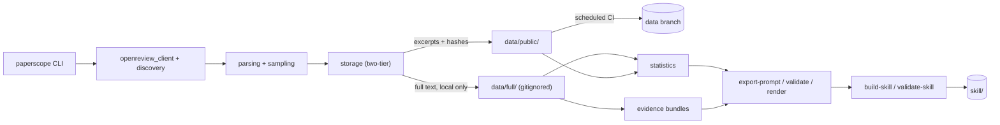

# PaperScope

[](https://github.com/lakshayxi/paperscope/actions/workflows/ci.yml)
[](https://github.com/lakshayxi/paperscope/actions/workflows/fetch-reviews.yml)

A venue-calibrated ML paper reviewer built from real peer reviews on OpenReview (2023–2026).

PaperScope fetches real reviews from top ML/NLP/Vision venues, builds venue-calibration
reference files from claims that are validated — never hand-waved — against that data,
and packages them as a Claude Code skill: when you ask Claude to review a paper for a
venue with a validated reference, the review is grounded in real accept/reject signals
and reviewer language from that venue, not generic AI-assistant intuition. Every claim
states its own support level, and venues without a validated reference get an explicit,
un-calibrated review rather than a guess dressed up as one.

---

## What it does

1. **Fetches** real peer reviews from OpenReview — one paper-centric record per forum,
   with reviews, rebuttals, and decisions nested together, not scattered across rows
2. **Accumulates** that data on a schedule, resumably and deduplicated, via a small
   GitHub Actions workflow
3. **Builds** venue calibration reference files — real score distributions, real
   accept/reject language, real hidden criteria
4. **Packages** everything as a Claude Code skill (`skill/`) that can be installed and
   used directly

---

## Architecture



`statistics` (`paperscope stats`), `evidence` (`paperscope evidence`), structured
generation (`paperscope export-prompt` / `render`, plus an optional `[llm]`-gated
`generate`), and the skill builder (`paperscope build-skill` / `validate-skill`) are all
built — deterministic, offline, no API keys needed for any of it; see
[`docs/statistics_and_evidence.md`](docs/statistics_and_evidence.md),
[`docs/generation.md`](docs/generation.md), and
[`docs/skill_building.md`](docs/skill_building.md). See
[`docs/redistribution.md`](docs/redistribution.md) for why review text is split into a
full local tier and a excerpted public tier.

---

## Supported Venues

`VENUES`/`VENUE_GROUPS` in [`src/paperscope/config.py`](src/paperscope/config.py) list
~35 venue-years across 7 families that the **fetcher** can pull from — the scheduled
automation currently targets **ICLR** by default (see
[Automation](#automation-github-actions) below), other families fetch fine via the CLI
directly, they're just not on the default schedule yet.

| Group | Venues |
|---|---|
| ICLR | 2023, 2024, 2025, 2026 |
| NeurIPS | 2023, 2024, 2025 |
| ICML / TMLR | 2023, 2024, 2025 + TMLR rolling |
| CVPR / ICCV / ECCV | CVPR 2023–2025, ICCV 2023, ECCV 2024 |
| ACL / EMNLP / NAACL | 2023–2025 |
| AAAI / IJCAI | 2023–2026 |
| KDD | 2023, 2024 |

**The installable skill (`skill/`) is a separate, much narrower claim.** It only ships a
validated, evidence-traced reference for venues that have actually been through
`paperscope build-skill` — right now that's **ICLR only**, and `skill/manifest.json`
marks it `"preliminary": true` (10 forums, ICLR 2026 only, 0 resolved decisions — see
[Known limitations](#known-limitations)). Fetching data for NeurIPS/ICML/CVPR/etc. does
not make the skill calibrated for them; requesting a review for any venue not listed in
`skill/manifest.json`'s `supported_venue_families` runs in explicit
`generic_uncalibrated` mode instead of silently guessing or falling back to ICLR's
conventions. See [`docs/skill_building.md`](docs/skill_building.md).

---

## Setup

```bash
git clone https://github.com/lakshayxi/paperscope
cd paperscope
pip install -e .
```

Set credentials (free account at [openreview.net](https://openreview.net)) — a token or
username/password both work; unauthenticated "guest" access is also supported by the
client but is unreliable in practice (OpenReview may challenge anonymous requests):

```bash
export OPENREVIEW_USERNAME='your_openreview_email'
export OPENREVIEW_PASSWORD='your_openreview_password'
# or: export OPENREVIEW_TOKEN='...'
```

---

## Usage

```bash
# Fetch unseen forums for a venue family/year
paperscope fetch venue --family iclr --years 2026 --papers 20 --seed 42

# Also refresh already-fetched forums that are unresolved or in an active review cycle
paperscope fetch venue --family iclr --years 2026 --refresh-policy active

# Fetch a single paper by URL
paperscope fetch forum --url "https://openreview.net/forum?id=XXXXX"

# Import an old corpus_<family>.json into the new schema
paperscope migrate corpus_iclr.json

# Deterministic, venue/year-scoped statistics -- writes statistics.json + statistics.md
paperscope stats --corpus data/full/iclr.jsonl --output artifacts/statistics

# Bounded, seeded evidence bundle for the calibration/generation phase
paperscope evidence --corpus data/full/iclr.jsonl --output artifacts/evidence_bundle.json --seed 42

# Export a self-contained prompt bundle for manual Claude Code use (no API key needed)
paperscope export-prompt --statistics artifacts/statistics/statistics.json \
                          --evidence artifacts/evidence_bundle.json --output artifacts/generation

# Deterministically render already-validated claims JSON into a reference file
paperscope render --claims artifacts/generation/claims.json \
                   --statistics artifacts/generation/statistics.json \
                   --evidence artifacts/generation/evidence.json --output artifacts/reference.md

# Optional, [llm]-gated: automate the "ask the model" step of export-prompt's output
paperscope generate --provider anthropic --model claude-sonnet-5 --prompt-dir artifacts/generation

# Build a validated, installable skill from validated claims + their statistics/evidence
paperscope build-skill --claims artifacts/claims.json \
                        --statistics artifacts/statistics/statistics.json \
                        --evidence artifacts/evidence_bundle.json --output skill

# Verify a built skill: file/hash/manifest integrity, no legacy leakage, no forbidden overclaims
paperscope validate-skill --path skill
```

`stats`, `evidence`, `export-prompt`, `render`, `build-skill`, and `validate-skill` are
all deterministic and offline (no OpenReview or Anthropic credentials needed); only the
optional `generate` command talks to a provider. See
[`docs/statistics_and_evidence.md`](docs/statistics_and_evidence.md),
[`docs/generation.md`](docs/generation.md), and
[`docs/skill_building.md`](docs/skill_building.md) for the full command reference,
output schemas, and known limitations.

Fetched data is stored two ways (see [Architecture](#architecture)):
`data/full/<family>.jsonl` (complete review text, never committed anywhere) and
`data/public/<family>.jsonl` + `<family>.manifest.json` (an excerpted, redistribution-
conscious index — this is what the CI workflow commits to the `data` branch).

Re-runs are deduplicated and resumable: a per-venue cursor tracks how far acquisition
has progressed, so repeated runs make progress instead of re-fetching the same forums.

### Legacy `expl.py`

`python expl.py bulk ...` / `python expl.py forum ...` still work — `expl.py` is now a
thin shim that explicitly translates them into the calls above. `analyze`/`skill`/`all`
aren't ported to the new CLI yet.

---

## Automation (GitHub Actions)

[`.github/workflows/fetch-reviews.yml`](.github/workflows/fetch-reviews.yml) runs
`paperscope fetch venue --refresh-policy active` on a schedule, so the corpus keeps
growing without a human running it manually.

- **Schedule**: weekly (Monday 06:00 UTC) — OpenReview data trickles in slowly, so daily
  polling would just burn CI minutes for near-zero new data most days.
- **Manual trigger**: Actions tab → *fetch-reviews* → *Run workflow*, with optional
  `family`/`years`/`papers`/`seed`/`refresh_policy` inputs.
- **Required secrets** (repo Settings → Secrets and variables → Actions):
  `OPENREVIEW_USERNAME` + `OPENREVIEW_PASSWORD`, or `OPENREVIEW_TOKEN`. No Anthropic key
  is needed for this workflow.
- **What's persisted, and where**: the workflow commits only to a dedicated `data`
  branch, never to `main` — the excerpted public index (`data/public/`), a resumability
  cursor (`data/full/*.cursors.json`, which carries no review content), and a compact
  `run_summary.json`. The full run log is uploaded as a workflow artifact (30-day
  retention), not committed anywhere.
- **Limitations**: fetch-only — `generate`/`build-skill` aren't part of this workflow and
  remain a manual/local step. Batches are intentionally small. Never merge or rebase the
  `data` branch into `main`; it's machine-generated state, not a feature branch.

---

## Installing the Skill

The `skill/` directory contains pre-built calibration files ready to use with Claude Code.

To install, copy the skill folder into Claude Code's skills directory:

```bash
cp -r skill/ ~/Library/Application\ Support/Claude/skills/paperscope
```

> The exact skills path may vary by OS and Claude Code version. Check your Claude Code settings for the correct location, or place the folder wherever Claude Code looks for custom skills.

Then in any Claude Code session:
- *"Review this paper for ICLR"*
- *"What score would this get at ICLR 2026?"*
- *"Give me a quick calibration snapshot for this abstract"*
- *"Assess whether this rebuttal addresses the reviewers' concerns"*

The skill resolves the venue against `skill/manifest.json` and loads the matching
reference — for anything not in `manifest.json`'s `supported_venue_families` (today,
that's every venue except ICLR), it runs in explicit `generic_uncalibrated` mode instead
of guessing or silently falling back to ICLR's conventions. See
[`docs/skill_building.md`](docs/skill_building.md).

See [`demo/`](demo/) for a sample fetched batch, corpus snapshot stats, one example
review generated by the pre-redesign skill, and worked structured-generation /
skill-build examples (`sample_claims.json` → `sample_reference.md` →
`sample_skill_reference.md`, see [`docs/generation.md`](docs/generation.md) and
[`docs/skill_building.md`](docs/skill_building.md)).

---

## Updating the Skill (the learning loop)

`skill/` is now **generated, not hand-edited** — `paperscope build-skill` writes
`skill/SKILL.md`, `skill/manifest.json`, and `skill/references/<family>.md` from
validated claims; nothing under those paths should be edited by hand anymore (edits
would just be overwritten by the next build). The hand-edited files from before this
redesign are preserved, unreachable, under
[`skill/references/legacy/`](skill/references/legacy/).

```bash
paperscope fetch venue --family iclr --years 2026 --papers 20
paperscope stats    --corpus data/full/iclr.jsonl --output artifacts/statistics
paperscope evidence  --corpus data/full/iclr.jsonl --output artifacts/evidence_bundle.json --seed 42
# -> hand-author (or export-prompt/render through Claude Code) artifacts/claims.json,
#    grounded against the two files above and passing generation.validate_claims
paperscope build-skill --claims artifacts/claims.json \
                        --statistics artifacts/statistics/statistics.json \
                        --evidence artifacts/evidence_bundle.json --output skill
paperscope validate-skill --path skill
```

Claims **accumulate** knowledge across builds the same way the old hand-written files
did — nothing is deleted, only re-derived from a growing corpus and re-validated. See
[`docs/skill_building.md`](docs/skill_building.md) for the full workflow, manifest
schema, atomicity/fail-closed guarantees, and legacy-isolation design.

---

## How calibration works

Each generated `skill/references/<venue>.md` file is built entirely from validated
claims (`generation.validate_claims`) and states, per claim, one of five `claim_type`s —
`deterministic_fact`, `statistical_pattern`, `evidence_excerpt`, `llm_interpretation`, or
`insufficient_evidence` — plus a `support_level` and explicit `limitations`. Sections
covered:

- **Score calibration** — rating distributions and rating/decision crosstabs from real data, with sample size and decision-resolution status stated up front
- **Accept signals** — patterns that correlate with high scores, backed by real reviewer quotes
- **Reject signals** — patterns that reliably cause rejection, with exact quotes showing how reviewers phrase them
- **Hidden criteria** — model interpretations inferred from review data, explicitly labeled as interpretation rather than fact
- **Reviewer language** — accept vs. reject tier phrasing, only once decisions have resolved enough to support the comparison
- **Year-over-year drift** — only stated once at least two venue-years of comparable statistics exist; otherwise an explicit `insufficient_evidence` claim
- **Rebuttal effectiveness** — only stated once initial→final rating deltas exist in the corpus; otherwise an explicit `insufficient_evidence` claim

A reference file never smooths over a gap — see the current
[`skill/references/iclr.md`](skill/references/iclr.md), where Year-over-year Drift and
Rebuttal Effectiveness are both `insufficient_evidence` because the underlying corpus
doesn't support them yet.

---

## Project Structure

```
paperscope/
├── expl.py                        # legacy-command compatibility shim
├── pyproject.toml
├── src/paperscope/
│   ├── config.py                  # venue registry, schema/refresh defaults
│   ├── models.py                  # ForumRecord paper-centric schema
│   ├── openreview_client.py       # auth (token / password / guest)
│   ├── discovery.py                # review-invitation discovery
│   ├── parsing.py                  # note parsing, ForumRecord construction
│   ├── sampling.py                 # seeded/deterministic acquisition
│   ├── refresh_policy.py           # existing-forum refresh selection
│   ├── storage.py                  # two-tier JSONL + manifest, migration
│   ├── statistics.py                # deterministic venue/year-scoped stats
│   ├── evidence.py                  # bounded, seeded evidence bundles
│   ├── generation.py                # structured claims: export-prompt, validate, render
│   ├── llm_provider.py              # [llm]-gated `generate`; sole file that imports anthropic
│   ├── skill_builder.py             # build-skill / validate-skill (Phase 4A)
│   ├── venue_resolution.py          # deterministic venue lookup, no ICLR fallback
│   └── cli.py                      # `paperscope` entry point
├── tests/
├── .github/workflows/
│   ├── ci.yml                      # lint + test
│   └── fetch-reviews.yml           # scheduled fetch automation
├── docs/
│   ├── redistribution.md
│   ├── statistics_and_evidence.md
│   ├── generation.md
│   └── skill_building.md
├── demo/
├── skill/                          # generated by `paperscope build-skill` -- do not hand-edit
│   ├── SKILL.md                    # Claude Code skill definition
│   ├── manifest.json               # machine-readable reference manifest + provenance
│   └── references/
│       ├── iclr.md                 # validated, generated
│       └── legacy/                 # archival, hand-written, pre-redesign -- never loaded
└── README.md
```

---

## Adding a New Venue

1. Add a tuple to `VENUES` in `src/paperscope/config.py`: `("CONF YEAR", "venue.org/CONF/YEAR/Conference", "v2", "family")`
2. Add the display name to the right list in `VENUE_GROUPS`
3. Run `paperscope fetch venue --family <family>` — the resumability cursor means only new forums get fetched
4. Fetching alone does **not** add the venue to the installable skill — run the
   `stats`/`evidence`/claims/`build-skill` workflow in
   [`docs/skill_building.md`](docs/skill_building.md) once there's enough real data to
   ground validated claims, then `paperscope validate-skill` will confirm the new
   family is correctly listed in `skill/manifest.json`.

---

## Known limitations

- **`skill/references/iclr.md` is preliminary.** Its own `manifest.json` says so
  (`"preliminary": true`) — it's built from 10 forums, ICLR 2026 only, an active
  (unresolved) review cycle: `decisions_resolved` is 0, so nothing in it states or
  implies an acceptance rate or score threshold. Year-over-year drift and rebuttal
  effectiveness are both explicit `insufficient_evidence` claims, not guesses. This will
  improve automatically as the scheduled fetch automation accumulates more data and
  review cycles resolve.
- **Only ICLR is calibrated today.** NeurIPS/ICML/CVPR/etc. all fetch fine (see
  [Supported Venues](#supported-venues)) but have no validated skill reference yet —
  requesting a review for them runs in `generic_uncalibrated` mode, not a silently
  degraded ICLR-flavored review.
- **`build-skill` takes one statistics/evidence pair per invocation.** It can cover
  every venue family present in that pair, but there's no command yet to merge two
  separately-built skills — see [`docs/skill_building.md`](docs/skill_building.md).
- **Claims are still hand-authored or produced via the Phase 3B manual workflow** —
  nothing automates writing `claims.json` from a corpus yet; a human (or Claude, by
  hand, through `export-prompt`/`render`) still grounds every claim.

---

## Requirements

- Python 3.11+
- `openreview-py`
- OpenReview account (free at [openreview.net](https://openreview.net))

No Anthropic API key is needed for fetching, storage, statistics, evidence bundles,
`export-prompt`, `render`, or the CI automation. `anthropic` is an optional dependency
(`pip install -e ".[llm]"`) needed only for `paperscope generate` — see
[`docs/generation.md`](docs/generation.md).
